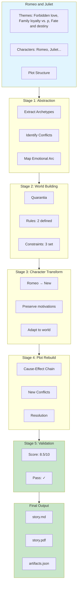

# Transformation Visualization

## Pipeline Flow

## Character Mapping

| Original | Archetype | → | Transformed | Role | Preserved |
|----------|-----------|---|-------------|------|----------|
|  | N/A | → | N/A | N/A | ◐ |
|  | N/A | → | N/A | N/A | ◐ |
|  | N/A | → | N/A | N/A | ◐ |

## Theme Flow

| Original Theme | → | World Expression |
|----------------|---|------------------|
| Forbidden love | → | The love between the two characters, fro... |
| Family loyalty vs. person | → | The boy must choose between his loyalty ... |
| Fate and destiny | → | The characters' lives are dictated by th... |
| Youth vs. age | → | The impulsive nature of the young lovers... |
| Violence and its conseque | → | The desperation and frustration of being... |
| The power of passion | → | The all-consuming love between the two c... |

## Quality Breakdown

- **Thematic Fidelity**: [████████░░] 8/10
- **Internal Consistency**: [█████████░] 9/10
- **Originality Check**: [████████░░] 8/10
- **Cultural Sensitivity**: [█████████░] 9/10

**Overall**: 8.5/10 | PASSED ✓
